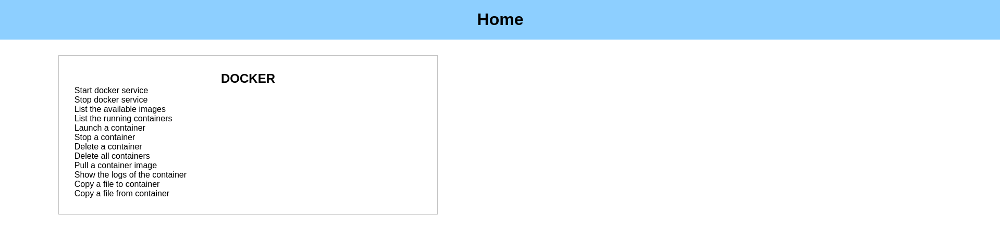
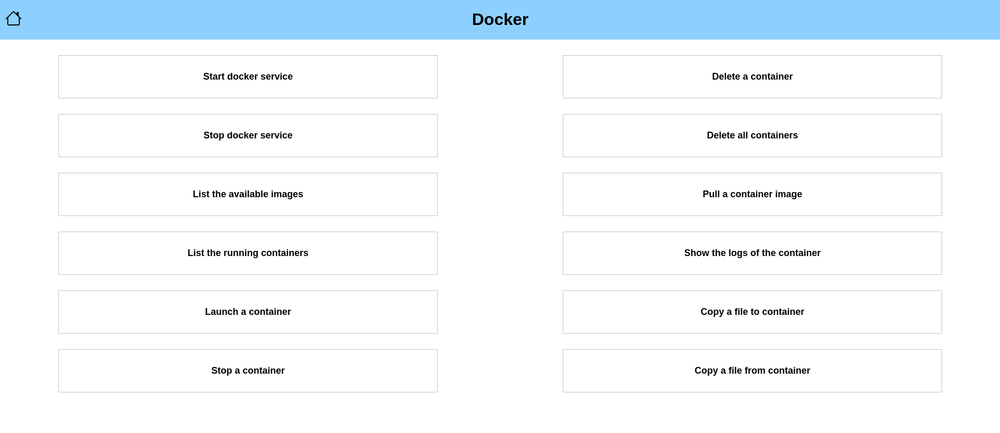

# Platforms supported
```
Linux
```
# Installation Procedure:
Firstly you will need an apache webserver based on the linux platform you are working on install the suitable apache webserver. After installing the apache webserver you will need to configure the cgi application. Firstly you will need to enable the cgi module then you will need to configure it. For Example on ubuntu you will need to go to `/etc/apache2` directory where you will find the folowing directories:

- `mods-available`
    This directory consists of the modules that are available
- `mods-enabled`
    This directory consists of the modules that are enabled
- `conf-available`
    This directory consists of the configurations available
- `conf-enabled`
    This directory consists of the configuration enabled

The cgi application requires `cgi.load`, `cgid.load`, `cgid.conf` modules to be loaded hence we need to load them into the `mods-enabled` directory after doing this. We need to create the configuration for cgi-server this can be done by using the file in the `conf-available`. The default configuration file looks as follows
```
#/etc/apache2/conf-available/serve-cgi-bin.conf
<IfModule mod_alias.c>
        <IfModule mod_cgi.c>
                Define ENABLE_USR_LIB_CGI_BIN
        </IfModule>

        <IfModule mod_cgid.c>
                Define ENABLE_USR_LIB_CGI_BIN
        </IfModule>

        <IfDefine ENABLE_USR_LIB_CGI_BIN>
                ScriptAlias /cgi-bin /usr/lib/cgi-bin
                <Directory "/usr/lib/cgi-bin">
                        AllowOverride None
                        Options +ExecCGI -MultiViews +SymLinksIfOwnerMatch
                        Require all granted
                </Directory>
        </IfDefine>
</IfModule>
```

We need to create a new configuration file in `conf-enabled` which looks as follow:
```
#/etc/apache2/conf-available/serve-cgi-bin.conf
<IfModule mod_alias.c>
        <IfModule mod_cgi.c>
                Define ENABLE_USR_LIB_CGI_BIN
        </IfModule>

        <IfModule mod_cgid.c>
                Define ENABLE_USR_LIB_CGI_BIN
        </IfModule>

        <IfDefine ENABLE_USR_LIB_CGI_BIN>
                DirectoryIndex home home.py
                ScriptAlias <alias_you_want> <location_for_the_code>
                <Directory "<location_for_the_code>">
                        AllowOverride None
                        Options +ExecCGI -MultiViews +SymLinksIfOwnerMatch
                        Require all granted
                </Directory>
        </IfDefine>
</IfModule>
```

In the above file replace the `<alias_you_wanted>` with the route you want to serve the cgi-application and `<location_for_the_code>` with the path where you downloaded the application.

Now you can restart the webserver.

Now need to use the env.py file where you will need to provide the alias provided for the cgi application(i.e. `<alias_you_wanted>`) in the apache webserver configuration file to the `cgiRoute` variable.

Now that's not done you will need to allow the apache user to use sudo without password. This can be done by changing the `/etc/sudoers` file. Following is the line you need to add to the `/etc/sudoers` file:

```
<user>    ALL=(ALL:ALL)   NOPASSWD: ALL
```

Where `<user>` is the user name of the apache user you will need to replace this will the appropriate user of the apache webserver. For `apache2` on ubuntu its `www-data` and for `httpd`  its `apache`. This will allow the apache user to use `sudo` command without password.

Now you will need to restart the webserver.

After restarting the webserver you will be able to access the application on `http://<hostname/ip>:<port>/<alias_for_cgi_script>` where hostname is the DNS hostname if your DNS is configured you can use it, ip is the IP address of the server, port is the port number configured, alias_for_cgi_script is the cgiRoute you have provided in the `env.py` file.

## Now you will be able to see the following outputs:

In my configuration `/cgi-bin` is the alias_for_cgi_script hence following is the output:

Home page(/cgi-bin):


Docker page page(/cgi-bin/docker):


The docker submenu page has the links for various functionalities.